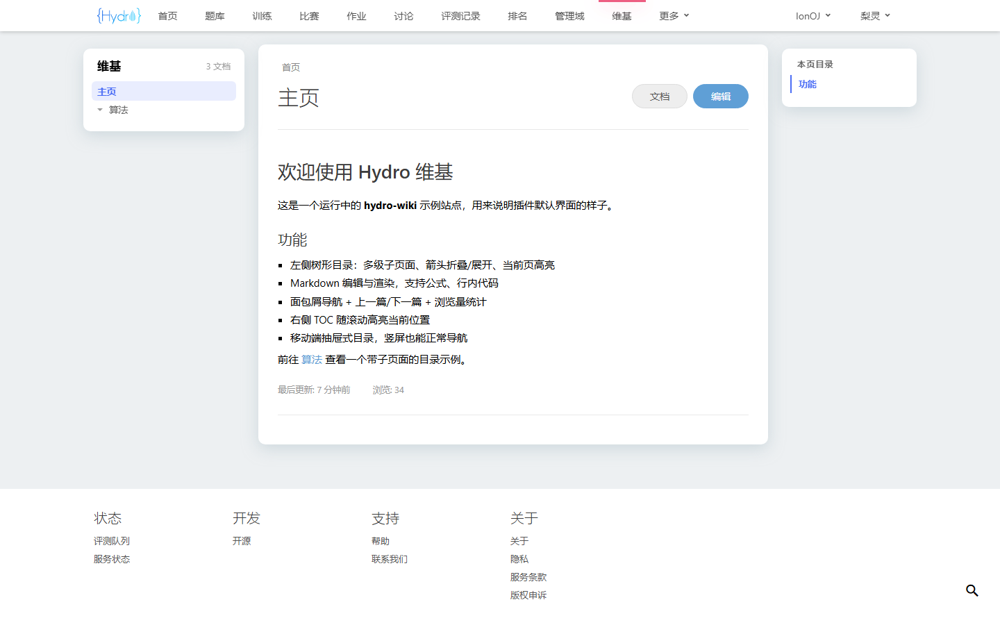
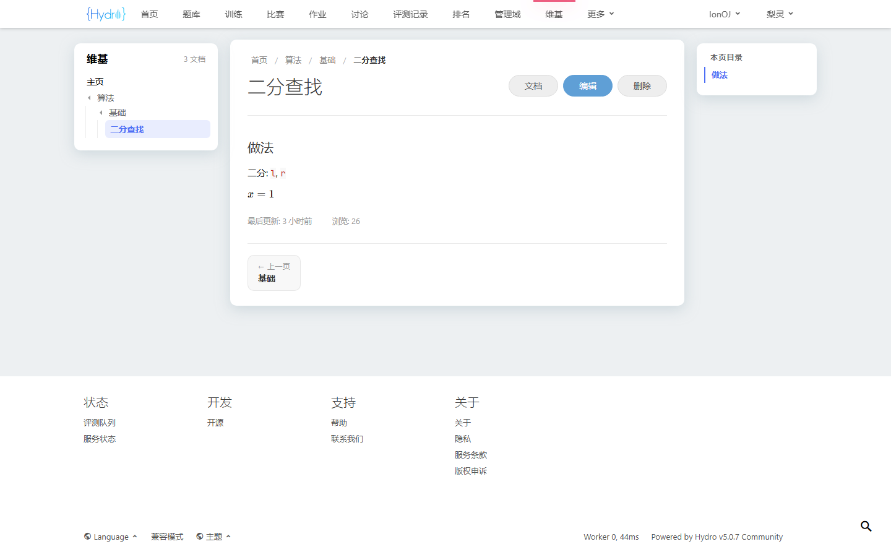
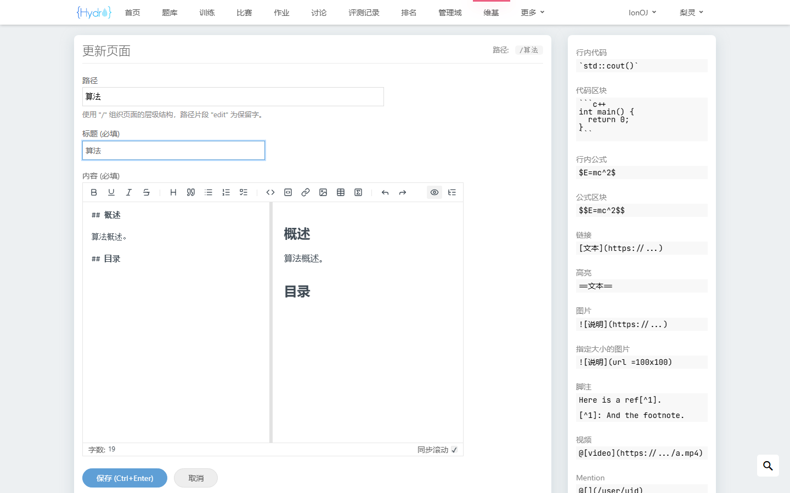
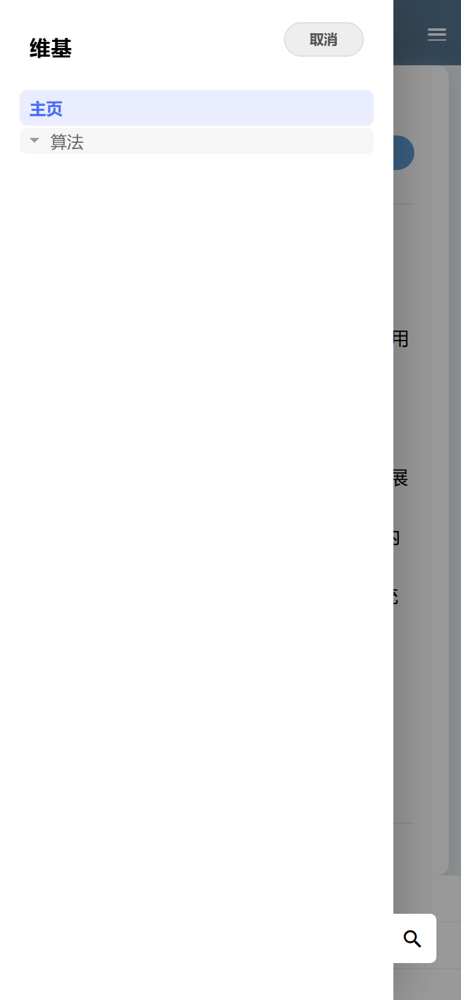

# hydro-wiki

HydroOJ 全站维基插件，采用 OI-wiki 风格的三栏布局（左侧文档树、中部正文、右侧目录），支持多级路径、Markdown 编辑与页面管理。

## 功能特性

- **多级路径页面**：`/wiki/算法/基础/二分`，自动生成面包屑、侧栏文档树、上一页 / 下一页导航
- **Markdown 编辑**：复用 Hydro 内置的 `data-markdown` 编辑器
- **页面管理**：新建、编辑、移动（重命名）、删除；删除会级联移除整棵子树
- **首页特殊处理**：挂载于 Path 为空字符串的文档，不可被移动或删除
- **权限控制**：`PRIV_USER_PROFILE` 可读，`PRIV_EDIT_SYSTEM` 可编辑
- **导航栏**：自动注入「维基」入口并做前缀高亮
- **阅读体验**：右侧目录滚动跟随（IntersectionObserver）、移动端抽屉式文档树、空状态引导
- **多语言**：zh / zh_TW / en 完整翻译
- **统计**：记录浏览量（views）、编辑者（owner / ip）与更新时间（updateAt）

## 运行截图

桌面端：

| 首页（三栏布局 + 文档树） | 多级页面（树形折叠/展开） |
| ------------------------- | ------------------------- |
|  |  |

| 编辑页面 | 移动端竖屏（抽屉式目录） |
| -------- | ----------------------- |
|  |  |

## 部署

```bash
mkdir -p /root/hydro-wiki/templates
cp index.ts /root/hydro-wiki/
cp templates/wiki_main.html templates/wiki_edit.html /root/hydro-wiki/templates/
pm2 restart hydrooj
```

将目录注册为 Hydro addon 后，重启即自动加载 `index.ts`。数据存储于 MongoDB 的 `hydro.wiki` 集合。

## 路由

| 方法   | 路径                    | 权限                     | 说明                       |
| ------ | ----------------------- | ------------------------ | -------------------------- |
| GET    | `/wiki`                 | `PRIV_USER_PROFILE`      | 首页                       |
| GET    | `/wiki/*path`           | `PRIV_USER_PROFILE`      | 维基页面                   |
| GET    | `/wiki/edit`            | `PRIV_EDIT_SYSTEM`       | 编辑首页                   |
| GET    | `/wiki/*path/edit`      | `PRIV_EDIT_SYSTEM`       | 编辑 / 新建 / 移动 / 删除  |

编辑表单通过隐藏域 `operation`（`save` / `delete`）区分动作，`path` 为目标路径，`oldpath` 为原路径（移动时提供）。

## 开发注意事项

- Hydro 的包入口不导出 `Err`，应使用 `import { CreateError as Err } from 'hydrooj'`。
- `Types.String` 拒绝空字符串（min 1），因此首页（空路径）的 `path` / `oldpath` 参数必须声明为可选 `Types.String, true`，并且前端页面在保存首页时不提交空的 `path` 字段。
- 删除 / 移动使用正则定位子树，必须同时命中页面自身与后代：`^前缀(?:/.*)?$`，否则根页面无法被删除。

## License

[MIT](LICENSE)